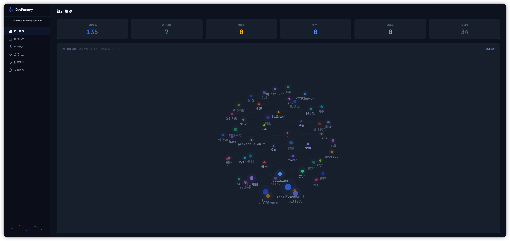

🌐 [简体中文](../README.md) | [繁體中文](README.zh-TW.md) | English | [Español](README.es.md) | [Deutsch](README.de.md) | [Français](README.fr.md) | [日本語](README.ja.md)

<p align="center">
  <h1 align="center">🧠 AIVectorMemory</h1>
  <p align="center">
    <strong>Give your AI coding assistant a memory — Cross-session persistent memory MCP Server</strong>
  </p>
  <p align="center">
    <a href="https://pypi.org/project/aivectormemory/"></a>
    <a href="https://pypi.org/project/aivectormemory/"></a>
    <a href="https://github.com/Edlineas/aivectormemory/blob/main/LICENSE"></a>
    <a href="https://modelcontextprotocol.io"></a>
  </p>
</p>

---

> **Problem**: AI assistants "forget" everything with each new session — repeating the same mistakes, forgetting project conventions, losing development progress. Worse, to compensate for this amnesia, you have to inject massive context into every conversation, wasting tokens.
>
> **AIVectorMemory**: Provides a local vector memory store for AI via the MCP protocol, letting it remember everything — project knowledge, pitfalls, development decisions, work progress — persisted across sessions. Semantic retrieval recalls on demand, no more bulk injection, dramatically reducing token consumption.

## ✨ Core Features

| Feature | Description |
|---------|-------------|
| 🔍 **Semantic Search** | Vector similarity based — searching "database timeout" finds "MySQL connection pool pitfall" |
| 🏠 **Fully Local** | ONNX Runtime local inference, no API Key needed, data never leaves your machine |
| 🔄 **Smart Dedup** | Cosine similarity > 0.95 auto-updates, no duplicate storage |
| 📊 **Web Dashboard** | Built-in management UI with 3D vector network visualization |
| 🔌 **All IDEs** | OpenCode / Claude Code / Cursor / Kiro / Windsurf / VSCode / Trae and more |
| 📁 **Project Isolation** | Single DB shared across projects, auto-isolated by project_dir |
| 🏷️ **Tag System** | Memory categorization, tag search, rename, merge |
| 💰 **Save Tokens** | Semantic retrieval on demand replaces bulk context injection, reducing 50%+ redundant token usage |
| 📋 **Issue Tracking** | Lightweight issue tracker, AI auto-records and archives |

## 🏗️ Architecture

```
┌─────────────────────────────────────────────────┐
│                   AI IDE                         │
│  OpenCode / Claude Code / Cursor / Kiro / ...   │
└──────────────────────┬──────────────────────────┘
                       │ MCP Protocol (stdio)
┌──────────────────────▼──────────────────────────┐
│              AIVectorMemory Server               │
│                                                  │
│  ┌──────────┐ ┌──────────┐ ┌──────────────────┐ │
│  │ remember │ │  recall   │ │   auto_save      │ │
│  │ forget   │ │  digest   │ │   status/track   │ │
│  └────┬─────┘ └────┬─────┘ └───────┬──────────┘ │
│       │            │               │             │
│  ┌────▼────────────▼───────────────▼──────────┐  │
│  │         Embedding Engine (ONNX)            │  │
│  │      intfloat/multilingual-e5-small        │  │
│  └────────────────────┬───────────────────────┘  │
│                       │                          │
│  ┌────────────────────▼───────────────────────┐  │
│  │     SQLite + sqlite-vec (Vector Index)     │  │
│  │     ~/.aivectormemory/memory.db            │  │
│  └────────────────────────────────────────────┘  │
└──────────────────────────────────────────────────┘
```

## 🚀 Quick Start

### Option 1: pip install

```bash
pip install aivectormemory
cd /path/to/your/project
run install          # Interactive IDE selection, one-click setup
```

### Option 2: uvx (zero install)

```bash
cd /path/to/your/project
uvx aivectormemory install
```

### Option 3: Manual configuration

```json
{
  "mcpServers": {
    "aivectormemory": {
      "command": "run",
      "args": ["--project-dir", "/path/to/your/project"]
    }
  }
}
```

<details>
<summary>📍 IDE Configuration File Locations</summary>

| IDE | Config Path |
|-----|------------|
| Kiro | `.kiro/settings/mcp.json` |
| Cursor | `.cursor/mcp.json` |
| Claude Code | `.mcp.json` |
| Windsurf | `.windsurf/mcp.json` |
| VSCode | `.vscode/mcp.json` |
| Trae | `.trae/mcp.json` |
| OpenCode | `opencode.json` |
| Claude Desktop | `~/Library/Application Support/Claude/claude_desktop_config.json` |

</details>

## 🛠️ 7 MCP Tools

### `remember` — Store a memory

```
content (string, required)   Memory content in Markdown format
tags    (string[], required)  Tags, e.g. ["pitfall", "python"]
scope   (string)              "project" (default) / "user" (cross-project)
```

Similarity > 0.95 auto-updates existing memory, no duplicates.

### `recall` — Semantic search

```
query   (string)     Semantic search keywords
tags    (string[])   Exact tag filter
scope   (string)     "project" / "user" / "all"
top_k   (integer)    Number of results, default 5
```

Vector similarity matching — finds related memories even with different wording.

### `forget` — Delete memories

```
memory_id  (string)     Single ID
memory_ids (string[])   Batch IDs
```

### `status` — Session state

```
state (object, optional)   Omit to read, pass to update
  is_blocked, block_reason, current_task,
  next_step, progress[], recent_changes[], pending[]
```

Maintains work progress across sessions, auto-restores context in new sessions.

### `track` — Issue tracking

```
action   (string)   "create" / "update" / "archive" / "list"
title    (string)   Issue title
issue_id (integer)  Issue ID
status   (string)   "pending" / "in_progress" / "completed"
content  (string)   Investigation content
```

### `digest` — Memory summary

```
scope          (string)    Scope
since_sessions (integer)   Last N sessions
tags           (string[])  Tag filter
```

### `auto_save` — Auto save

```
decisions[]      Key decisions
modifications[]  File modification summaries
pitfalls[]       Pitfall records
todos[]          Todo items
```

Auto-categorizes, tags, and deduplicates at the end of each conversation.

## 📊 Web Dashboard

```bash
run web --port 9080
```

Visit `http://localhost:9080` in your browser.

- Multi-project switching, memory browse/search/edit/delete
- Session status, issue tracking
- Tag management (rename, merge, batch delete)
- 3D vector memory network visualization
- 🌐 Multi-language support (简体中文 / 繁體中文 / English / Español / Deutsch / Français / 日本語)

<p align="center">
  
  <br>
  <em>Project Selection</em>
</p>

<p align="center">
  
  <br>
  <em>Overview & Vector Network Visualization</em>
</p>

## ⚡ Pairing with Steering Rules

AIVectorMemory is the storage layer. Use Steering rules to tell AI when to call it:

```markdown
# Memory Management
- New session: call status to read state
- Hit a pitfall: call remember to record
- Looking for experience: call recall to search
- End of conversation: call auto_save to save
```

| IDE | Steering Location |
|-----|------------------|
| Kiro | `.kiro/steering/*.md` |
| Cursor | `.cursor/rules/*.md` |
| Claude Code | `CLAUDE.md` |

## 🇨🇳 Users in China

The embedding model (~200MB) is auto-downloaded on first run. If slow:

```bash
export HF_ENDPOINT=https://hf-mirror.com
```

Or add env to MCP config:

```json
{
  "env": { "HF_ENDPOINT": "https://hf-mirror.com" }
}
```

## 📦 Tech Stack

| Component | Technology |
|-----------|-----------|
| Runtime | Python >= 3.10 |
| Vector DB | SQLite + sqlite-vec |
| Embedding | ONNX Runtime + intfloat/multilingual-e5-small |
| Tokenizer | HuggingFace Tokenizers |
| Protocol | Model Context Protocol (MCP) |
| Web | Native HTTPServer + Vanilla JS |

## License

MIT
